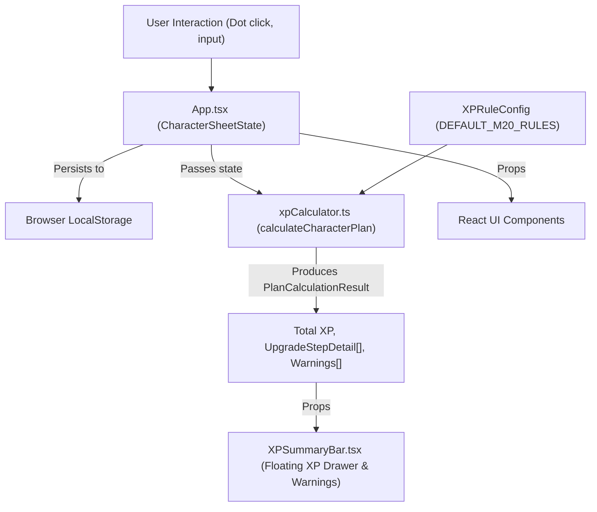
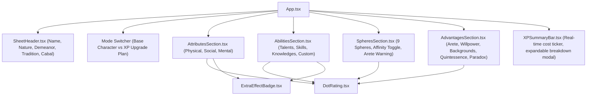

# System Architecture

This document describes the architectural design, component hierarchy, state flow, and mathematical calculation engine of the **M20 Character Sheet & XP Calculator**.

---

## 🏛️ System Overview

The application is a client-side Single Page Application (SPA) designed to provide instant, reactive experience point calculations for tabletop roleplaying characters in White Wolf / Onyx Path's *Mage: The Ascension 20th Anniversary Edition (M20)*.

Key architectural pillars:
- **Separation of Concerns**: Mathematical calculation logic is strictly decoupled from UI rendering.
- **Pure Functional Engine**: Calculation functions in [`src/engine/xpCalculator.ts`](file:///home/mike/Documents/TTRPG/Mage/ts-mage-calculator/src/engine/xpCalculator.ts) are deterministic and side-effect free.
- **Type Safety**: Domain entities are strictly typed via TypeScript in [`src/types/character.ts`](file:///home/mike/Documents/TTRPG/Mage/ts-mage-calculator/src/types/character.ts).
- **Zero-Latency Reactivity**: Plan calculations execute in memory on every dot change using React `useMemo`.

---

## 🔄 High-Level Data Flow



---

## 🧩 Component Hierarchy

The UI is divided into modular sections corresponding to traditional Mage character sheets:



### Component Roles

| Component | Responsibility |
| :--- | :--- |
| [`App.tsx`](file:///home/mike/Documents/TTRPG/Mage/ts-mage-calculator/src/App.tsx) | Root coordinator: initializes state from `localStorage`, runs `calculateCharacterPlan`, orchestrates trait mutations. |
| [`SheetHeader.tsx`](file:///home/mike/Documents/TTRPG/Mage/ts-mage-calculator/src/components/SheetHeader.tsx) | Displays and edits character biographical information (Tradition, Nature, Demeanor, Cabal). |
| [`AttributesSection.tsx`](file:///home/mike/Documents/TTRPG/Mage/ts-mage-calculator/src/components/AttributesSection.tsx) | Renders Physical, Social, and Mental attribute columns with dot selectors, specialties, and 5-dot mastery badges. |
| [`AbilitiesSection.tsx`](file:///home/mike/Documents/TTRPG/Mage/ts-mage-calculator/src/components/AbilitiesSection.tsx) | Renders Talents, Skills, and Knowledges; supports adding dynamic custom abilities and specialty drawer selection. |
| [`SpheresSection.tsx`](file:///home/mike/Documents/TTRPG/Mage/ts-mage-calculator/src/components/SpheresSection.tsx) | Renders the 9 Magickal Spheres; supports toggling Tradition Affinity and displays Arete cap validation indicators. |
| [`AdvantagesSection.tsx`](file:///home/mike/Documents/TTRPG/Mage/ts-mage-calculator/src/components/AdvantagesSection.tsx) | Renders Arete, Willpower, Background traits, and Quintessence/Paradox wheels. |
| [`DotRating.tsx`](file:///home/mike/Documents/TTRPG/Mage/ts-mage-calculator/src/components/DotRating.tsx) | Low-level interactive dot widget (supports 0–5 or 0–10 dots, base dots vs target upgrade dots). |
| [`ExtraEffectBadge.tsx`](file:///home/mike/Documents/TTRPG/Mage/ts-mage-calculator/src/components/ExtraEffectBadge.tsx) | Renders clickable tags for 4-dot specialties and 5-dot Mastery Extra Effects. |
| [`XPSummaryBar.tsx`](file:///home/mike/Documents/TTRPG/Mage/ts-mage-calculator/src/components/XPSummaryBar.tsx) | Sticky bottom bar displaying total calculated XP, validation warning badges, and an expandable itemized step-by-step audit modal. |

---

## 🧠 The Calculation Engine

The engine resides in [`src/engine/xpCalculator.ts`](file:///home/mike/Documents/TTRPG/Mage/ts-mage-calculator/src/engine/xpCalculator.ts).

### Multiplier Configuration (`XPRuleConfig`)

All cost multipliers and flat costs are encapsulated in [`XPRuleConfig`](file:///home/mike/Documents/TTRPG/Mage/ts-mage-calculator/src/engine/xpCalculator.ts#L8):

```typescript
export interface XPRuleConfig {
  attributeMultiplier: number;         // 4
  abilityMultiplier: number;           // 2
  newAbilityFlatCost: number;          // 3
  affinitySphereMultiplier: number;    // 7
  nonAffinitySphereMultiplier: number; // 8
  newSphereFlatCost: number;           // 10
  areteMultiplier: number;             // 8
  willpowerMultiplier: number;         // 1
  backgroundMultiplier: number;        // 2
}
```

This configuration design allows Storytellers to introduce house rules without modifying calculation algorithms.

### Step-by-Step Cost Resolution

Unlike simple linear formulas, White Wolf XP requires incremental step calculation (e.g., advancing an Attribute from 2 to 4 costs `(2 × 4) + (3 × 4) = 20 XP`).

Each calculation function computes an array of [`UpgradeStepDetail`](file:///home/mike/Documents/TTRPG/Mage/ts-mage-calculator/src/types/character.ts#L71):

```typescript
export interface UpgradeStepDetail {
  from: number;
  to: number;
  cost: number;
  formula: string;
}
```

This provides transparency to the player, generating audit formulas like `2 × 4 XP` and `3 × 4 XP`.

### Real-Time Validation

During plan calculation in [`calculateCharacterPlan()`](file:///home/mike/Documents/TTRPG/Mage/ts-mage-calculator/src/engine/xpCalculator.ts#L227), game constraints are evaluated:

- **Arete Sphere Ceiling**: A mage's sphere cannot exceed their Arete rating (M20 Core, p. 66).
  ```typescript
  if (sphere.target > effectiveArete) {
    warnings.push(
      `${sphere.name} target rating (${sphere.target}) exceeds character Arete (${effectiveArete}). A mage cannot raise a Sphere higher than their Arete rating.`
    );
  }
  ```
- **Seeking Warning**: Any Arete increase attaches a notification noting the requirement of a successful Seeking.

---

## 🗄️ State Management & Persistence

1. **State Shape**: Defined by [`CharacterSheetState`](file:///home/mike/Documents/TTRPG/Mage/ts-mage-calculator/src/types/character.ts#L57), storing:
   - `header`: Character biographical metadata.
   - `attributes`: 9 standard attributes indexed by ID.
   - `abilities`: 30 standard abilities + dynamic custom entries.
   - `spheres`: 9 magickal spheres with affinity flag.
   - `arete` & `willpower`: Trait models with min/max dot constraints.
   - `backgrounds`: Variable background traits.
   - `quintessence` & `paradox`: Current pool counters.
2. **Dual-Mode System**:
   - `base`: The starting rating of the character (e.g., character creation).
   - `target`: The planned rating. When `target > base`, the difference generates XP costs.
3. **Persistence**:
   - Synchronized automatically to `localStorage` under key `m20_mage_character_sheet_v1`.
   - On load, falls back to [`INITIAL_CHARACTER_STATE`](file:///home/mike/Documents/TTRPG/Mage/ts-mage-calculator/src/engine/initialState.ts#L3) if empty or invalid.

---

## 📚 Reference Data Architecture

The file [`src/data/specialtySuggestions.ts`](file:///home/mike/Documents/TTRPG/Mage/ts-mage-calculator/src/data/specialtySuggestions.ts) acts as a static lookup database:
- Maps each attribute and ability to canonical suggested specialties from the *M20 Core Rulebook*.
- Stores printed book page numbers (e.g. Strength -> p. 273, Occult -> p. 287).
- Enables the specialty picker drawer in [`AbilitiesSection`](file:///home/mike/Documents/TTRPG/Mage/ts-mage-calculator/src/components/AbilitiesSection.tsx) and [`AttributesSection`](file:///home/mike/Documents/TTRPG/Mage/ts-mage-calculator/src/components/AttributesSection.tsx).

---

## 🔮 Future Extensibility

1. **Custom House Rules Preset Manager**: Allow Storytellers to alter multipliers via UI and export rule profiles.
2. **Merits & Flaws System**: Point-buy integration with automatic XP adjustment.
3. **Character Import/Export**: JSON-based backup and sharing for gaming groups.
4. **Printable Character Sheet**: CSS `@media print` layout mirroring official character sheets.
